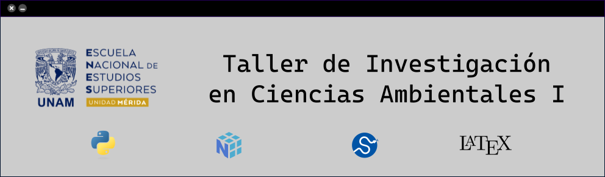

<div style="text-align: center;">
    
</div>  


# Bienvenidos al curso.
---

Accede al material del curso: [descargar.](https://github.com/ENES-Merida/taller-de-investigacion-en-ciencias-ambientales-I/archive/refs/heads/main.zip) 

En la carpeta `src` está el notebook de la clase.

Para activar el entorno de trabajo en tu computadora personal, sigue los siguientes pasos:

1. Abre el Explorador de archivos y ubica la carpeta donde se encuentran los archivos del material que descargaste.
2. Mantén presionada la tecla Shift y haz clic derecho en un espacio vacío dentro de la carpeta.
3. Selecciona 'Abrir ventana de comandos aquí'.
4. En la venta de comandos ejecuta lo siguiente:
   ```bash
    conda env create -f environment.yml
   ```
5. Activa el entorno de trabajo con la siguiente orden:
   ```bash
   conda activate enes_env
   ```
6. ¡Listo! Ya puedes utilizar el material que se te ha compartido.
7. Para desactivar el entorno de trabajo, haz lo siguiente:
    ```bash
    conda deactivate
    ```
### [**[Regresar al repositorio de Docencia]**](https://github.com/ENES-Merida/Docencia)